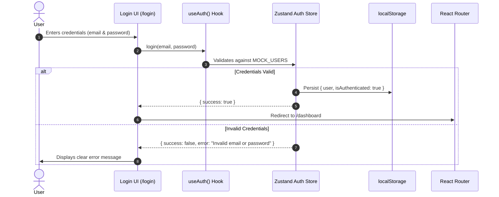
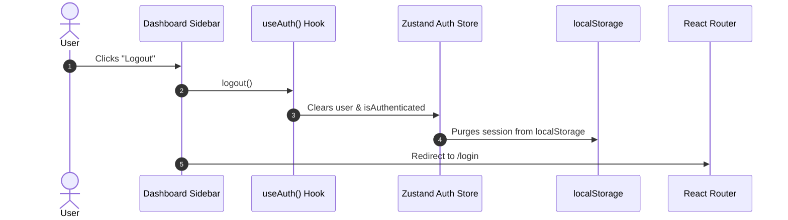

# Frontend Authentication

## Purpose

The purpose of frontend authentication in RestoControl is to manage user session state across workstations, safeguard administrative views, provide tailored operator experiences for distinct staff members, and establish the state management foundation for forthcoming role-based permission policies.

## Current Implementation

This implementation is a **client-side frontend mock authentication system**. It uses **Zustand** with persistent storage in **localStorage** and **React Router** for route guarding.

> [!NOTE]
> This is a simulated frontend-only authentication system designed for rapid prototyping, UX validation, and local workflow simulation. It does NOT connect to a real identity provider or authentication database yet.

---

## Mock Users

The system includes preconfigured mock accounts:

| User | Email / ID | Password | Role | Access Scope |
| :--- | :--- | :--- | :--- | :--- |
| **Admin** | `admin@restaurant.com` | `admin123` | `admin` | Full POS & Management Suite |
| **Staff** | `staff@restaurant.com` | `staff123` | `staff` | Staff Workstation Operations |

---

## Authentication Flow

1. **User input**: User provides email and password or uses the quick PIN touch keypad.
2. **Validation**: The `auth.store` verifies credentials against `MOCK_USERS`.
3. **Session persistence**: On success, user profile and authentication flag are saved to `localStorage` (`restocontrol_auth_session`).
4. **Redirection**: User is routed to `/dashboard` (or the initially requested protected URL).

---

## Logout Flow

1. User clicks the **Logout** button in the sidebar footer.
2. The `logout()` action clears the Zustand store state.
3. The stored session in `localStorage` is removed.
4. User is redirected to `/login`.

---

## Route Protection

The `<ProtectedRoute />` component wraps sensitive application views.

### Protected Routes
- `/dashboard` — Executive Telemetry & KPI Dashboard
- `/pos` — Staff POS Terminal
- `/orders` — Kitchen & Live Orders Queue
- `/menu` — Menu Item & Pricing Management
- `/tables` — Table Layout & QR Code Dispatch
- `/sales` — Sales Transactions & Receipts
- `/staff` — Roster & Staff Management
- `/reports` — Revenue & Station Metrics
- `/settings` — Restaurant Configuration & Branding

### Behavior
- If an unauthenticated user attempts to visit any protected route, the `ProtectedRoute` intercepts the request and redirects them to `/login` while preserving the intended destination in route state.
- After logging in, the user is automatically redirected back to their originally requested URL.

### Public Routes
- `/login` — Login Terminal
- `/customer` / `/qr` — Customer QR Menu Ordering interface (accessible without staff authentication)

---

## Future Backend

In upcoming phases, this frontend mock layer will connect to a secure backend authentication service:

- JWT / HttpOnly cookie session management
- Secure password hashing (Argon2id / bcrypt)
- Role-based Access Control (RBAC) middleware
- Refresh token rotation
- Audit log tracking for compliance
