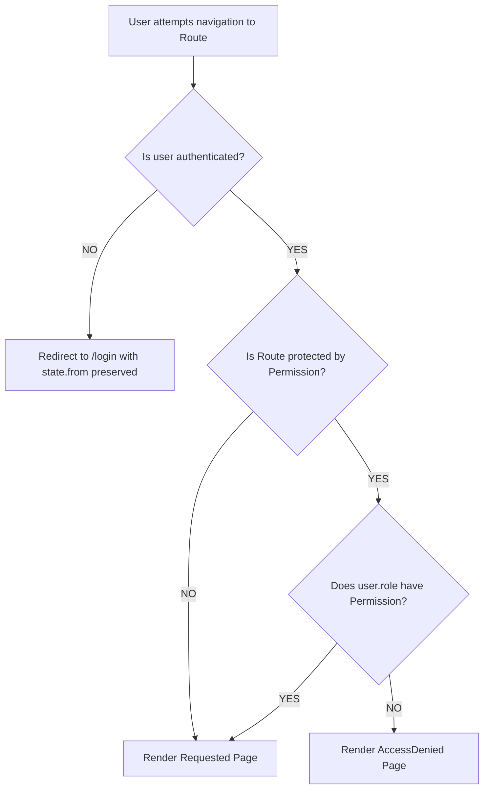
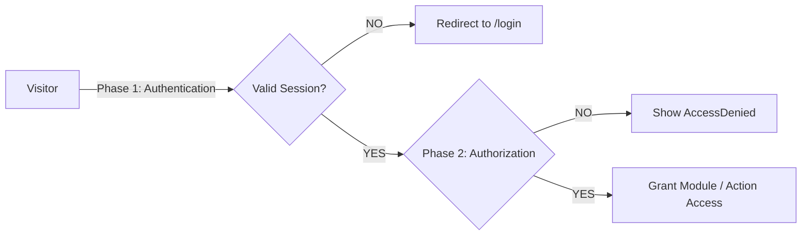

# Role-Based Access Control (RBAC) Architecture

## What RBAC Is

Role-Based Access Control (RBAC) is an access management methodology where system privileges and operational permissions are assigned to predefined **roles** rather than individual users directly. Users acquire capabilities exclusively by virtue of their assigned role.

In RestoControl, RBAC guarantees that:
- Core administrative, fiscal, and configuration areas are restricted to managerial staff.
- Daily service operations (POS order creation, menu lookup, table viewing) remain streamlined for floor staff without exposing destructive actions.
- Authorization checks are centralized, predictable, and decoupled from component presentation logic.

---

## Available Roles

The system supports two core frontend roles:

| Role | Identifier | Description |
| :--- | :--- | :--- |
| **Admin** | `admin` | Full operational, financial, staff, menu, and system management privileges. |
| **Staff** | `staff` | Floor staff capabilities focused on taking orders, running POS operations, and viewing menu/tables. |

---

## Available Permissions

The application defines 20 discrete, granular permission keys categorized by domain:

### 1. Dashboard
- `dashboard.view` — Access and view high-level operations telemetry and metrics.

### 2. POS Terminal
- `pos.use` — Operate the staff POS order-taking terminal.

### 3. Orders Management
- `orders.view` — View active orders, order queue, and ticket statuses.
- `orders.create` — Send new orders and dishes to the kitchen queue.
- `orders.update` — Transition order tickets between kitchen courses (e.g. *Fire*, *Complete*, *Deliver*).
- `orders.cancel` — Void or cancel active order tickets.

### 4. Menu & Products Management
- `menu.view` — Browse food catalog, categories, and stock availability.
- `menu.manage` — Add, update, or remove menu categories and settings.
- `products.view` — View detailed product entries and specifications.
- `products.create` — Add new dishes, drinks, and ingredients.
- `products.update` — Modify prices, Japanese names, descriptions, or stock levels.
- `products.delete` — Permanently delete dishes from the restaurant catalog.

### 5. Tables & QR Management
- `tables.view` — View restaurant floor plan, occupancy status, and active tables.
- `tables.manage` — Modify table sections, seat capacities, or QR code routing.

### 6. Sales & Financials
- `sales.view` — View revenue histories, payment logs, transaction tickets, and CSV export.

### 7. Staff Management
- `staff.view` — View staff roster, shift states, and active stations.
- `staff.manage` — Register new team members, edit names, or assign roles.

### 8. Reports & Analytics
- `reports.view` — View monthly gross revenue, ticket times, and station breakdown analytics.

### 9. System Settings
- `settings.view` — View restaurant profile, opening hours, language, and currency preferences.
- `settings.manage` — Update restaurant configuration, logo branding, and system preferences.

---

## Admin Permission Model

The **Admin** role is granted **ALL 20 permissions** by default.

```typescript
export const ADMIN_PERMISSIONS: readonly Permission[] = ALL_PERMISSIONS;
```

Admin capabilities include:
- Viewing and managing all restaurant operations, menu items, prices, and stock.
- Voiding/canceling tickets.
- Accessing sales history and exporting CSV financial reports.
- Managing staff roster and station assignments.
- Accessing executive reports and modifying restaurant branding and preferences.

---

## Staff Permission Model

The **Staff** role is granted a restricted subset of **8 operational permissions**:

| Permission | Granted to Staff | Purpose |
| :--- | :---: | :--- |
| `dashboard.view` | ✅ | Monitor real-time terminal status and kitchen speeds. |
| `pos.use` | ✅ | Take customer orders at the POS terminal. |
| `orders.view` | ✅ | View kitchen orders and ticket queue. |
| `orders.create` | ✅ | Dispatch new dishes and drinks to the kitchen. |
| `orders.update` | ✅ | Progress tickets through kitchen prep states. |
| `menu.view` | ✅ | Check dish details, ingredients, and prices. |
| `products.view` | ✅ | Look up product details. |
| `tables.view` | ✅ | Check table occupancy and seat availability. |

### Restricted Privileges (Forbidden for Staff)
Staff users are **NOT** permitted to:
- Void/cancel orders (`orders.cancel`)
- Add, modify, or delete menu items (`menu.manage`, `products.create`, `products.update`, `products.delete`)
- Modify table configurations (`tables.manage`)
- View sales histories or transaction amounts (`sales.view`)
- View or manage the staff roster (`staff.view`, `staff.manage`)
- View financial reports (`reports.view`)
- Access or modify system settings (`settings.view`, `settings.manage`)

---

## Centralized Verification Helper

All permission verification is performed via `hasPermission()` in [`src/auth/permissions.ts`](file:///Users/mac/Documents/RestoControl/RestoControl/src/auth/permissions.ts):

```typescript
import { hasPermission } from '../auth/permissions';

// Example:
const canViewReports = hasPermission(currentUser, 'reports.view');
// -> true for Admin
// -> false for Staff
```

---

## Permission Hook

The [`usePermission`](file:///Users/mac/Documents/RestoControl/RestoControl/src/hooks/usePermission.ts) hook provides a clean, declarative React interface for components to query authorization rules.

### Why `usePermission()` Exists
- **Decoupled Authorization**: React components do not need to know which roles have access to what feature or inspect `user.role` strings directly.
- **Centralized Single Source of Truth**: Integrates directly with the `hasPermission()` function from `src/auth/permissions.ts`.
- **Reactive State Management**: Automatically re-evaluates when the authenticated user changes (e.g. logging in as Admin vs. Staff, or logging out).
- **Type Safety**: Strictly typed with the `Permission` union type, preventing typos or invalid permission queries at compile time.

### Component Usage Example

```tsx
import React from 'react';
import { usePermission } from '../hooks/usePermission';
import { Button } from '../components/ui';

export function ActionToolbar() {
  const { hasPermission } = usePermission();

  return (
    <div className="flex gap-2">
      {/* Visible to both Admin and Staff */}
      {hasPermission('orders.create') && (
        <Button variant="primary">New Order</Button>
      )}

      {/* Visible only to Admin */}
      {hasPermission('orders.cancel') && (
        <Button variant="danger">Void Order</Button>
      )}

      {/* Visible only to Admin */}
      {hasPermission('reports.view') && (
        <Button variant="secondary">View Reports</Button>
      )}
    </div>
  );
}
```

---

## Route Authorization

Route authorization represents the second tier of the RestoControl access security system.

### Two-Tier Guard Evaluation Flow



1. **Authentication Layer**: Verifies that a valid session exists in `auth.store`. Unauthenticated attempts to access any protected route are immediately redirected to `/login`.
2. **Authorization Layer**: Evaluates whether the authenticated user's role satisfies the required route permission. If unauthorized, the user is intercepted and shown the `AccessDenied` page.
3. **Page Access**: The route is rendered only when both authentication and authorization evaluations succeed.

---

### Route to Permission Mapping

| Route URL | Required Permission | Admin Access | Staff Access |
| :--- | :--- | :---: | :---: |
| `/dashboard` | `dashboard.view` | ✅ Allowed | ✅ Allowed |
| `/pos` | `pos.use` | ✅ Allowed | ✅ Allowed |
| `/orders` | `orders.view` | ✅ Allowed | ✅ Allowed |
| `/menu` | `menu.view` | ✅ Allowed | ✅ Allowed |
| `/tables` | `tables.view` | ✅ Allowed | ✅ Allowed |
| `/sales` | `sales.view` | ✅ Allowed | ❌ **Denied** |
| `/staff` | `staff.view` | ✅ Allowed | ❌ **Denied** |
| `/reports` | `reports.view` | ✅ Allowed | ❌ **Denied** |
| `/settings` | `settings.view` | ✅ Allowed | ❌ **Denied** |

### Public Routes
These routes do not enforce staff authentication or role permissions:
- `/login` — Staff & Admin Login Terminal
- `/customer` & `/qr` — Customer QR Ordering Interface
- `/menu/:tableId` — Table-specific QR Menu Dispatch

---

## Access Denied

The [`AccessDenied`](file:///Users/mac/Documents/RestoControl/RestoControl/src/pages/AccessDenied.tsx) page provides a clear, consistent, and accessible feedback interface when an authenticated operator attempts to access a module outside their role permissions.

### When `AccessDenied` is Shown
- An **authenticated** user (e.g., `Staff`) attempts to navigate directly to an administrative route (e.g., `/reports`, `/settings`, `/staff`, or `/sales`).
- In contrast, an **unauthenticated** visitor attempting to reach these routes is immediately redirected to `/login`.

| State | Navigation Attempt | Result |
| :--- | :--- | :--- |
| **Unauthenticated** | Protected route (`/reports`, `/settings`, etc.) | 🔄 Redirect to `/login` |
| **Authenticated (Staff)** | Staff route (`/dashboard`, `/pos`, etc.) | ✅ Page rendered |
| **Authenticated (Staff)** | Admin-only route (`/reports`, `/settings`, etc.) | 🚫 `AccessDenied` displayed |
| **Authenticated (Admin)** | Any protected route | ✅ Page rendered |

### Back to Dashboard Behavior
- The `AccessDenied` view includes a prominent **Back to Dashboard** button.
- Clicking the button uses React Router's `useNavigate()` to return the operator safely to `/dashboard` without requiring a full page refresh.

---

## Permission-Based Navigation

The application uses a single shared sidebar navigation ([`DashboardLayout.tsx`](file:///Users/mac/Documents/RestoControl/RestoControl/src/layouts/DashboardLayout.tsx)) across all roles rather than maintaining disjointed Admin and Staff layouts.

### Dynamic Navigation Filtering
- Navigation links are registered in a centralized configuration array (`SIDEBAR_NAV_ITEMS`) where each entry associates a path and icon with a required `Permission`.
- When rendering the sidebar, items are dynamically filtered using `usePermission().hasPermission(item.permission)`.

```typescript
const visibleNavItems = SIDEBAR_NAV_ITEMS.filter((item) =>
  !item.permission || hasPermission(item.permission)
);
```

### Role Visibility Breakdown

| Navigation Label | Route | Required Permission | Admin Visible | Staff Visible |
| :--- | :--- | :--- | :---: | :---: |
| **Dashboard** | `/dashboard` | `dashboard.view` | ✅ | ✅ |
| **New Order** | `/pos` | `pos.use` | ✅ | ✅ |
| **Orders** | `/orders` | `orders.view` | ✅ | ✅ |
| **Menu** | `/menu` | `menu.view` | ✅ | ✅ |
| **Tables & QR** | `/tables` | `tables.view` | ✅ | ✅ |
| **Sales History** | `/sales` | `sales.view` | ✅ | ❌ Hidden |
| **Staff** | `/staff` | `staff.view` | ✅ | ❌ Hidden |
| **Reports** | `/reports` | `reports.view` | ✅ | ❌ Hidden |
| **Settings** | `/settings` | `settings.view` | ✅ | ❌ Hidden |

### Defense in Depth (UX vs. Security)
- **Hiding navigation is purely a UX optimization**: It prevents users from seeing links to features they cannot use, minimizing cognitive clutter and confusion.
- **Route authorization enforces security**: Hiding sidebar items is not a security mechanism. If a staff user attempts to navigate directly to `/reports` or `/settings` via URL manipulation or browser history, the `ProtectedRoute` authorization layer halts access and renders the `AccessDenied` page.

---

## Button and Action Permissions

Beyond page-level route authorization, sensitive buttons, mutating operations, and destructive controls are gated by granular permissions at the component level.

### Page Permissions vs. Action Permissions
- **Page Permissions (Macro-Level Authorization)**: Determine whether a user can access and view an entire module route (e.g. `/menu` guarded by `menu.view`).
- **Action Permissions (Micro-Level Authorization)**: Control specific interactive actions and mutating features within an accessible view (e.g. within `/menu`, adding a dish requires `products.create`, updating stock requires `products.update`, and deleting a dish requires `products.delete`).

### Declarative Gating via `<PermissionGate />`

The reusable [`PermissionGate`](file:///Users/mac/Documents/RestoControl/RestoControl/src/components/auth/PermissionGate.tsx) component conditionally mounts children based on the active user's permissions:

```tsx
import { PermissionGate } from '../components/auth/PermissionGate';

// Example: Gating destructive operations
<PermissionGate permission="products.delete">
  <button onClick={() => handleDelete(item.id)}>
    <Trash2 className="w-3.5 h-3.5" />
  </button>
</PermissionGate>
```

### Action Visibility & Access Matrix

| View | Action / Button | Required Permission | Admin | Staff |
| :--- | :--- | :--- | :---: | :---: |
| **Menu** | Add Menu Item | `products.create` | ✅ Visible | ❌ Hidden |
| **Menu** | Toggle Stock Status | `products.update` | ✅ Visible | ❌ Hidden |
| **Menu** | Delete Dish | `products.delete` | ✅ Visible | ❌ Hidden |
| **Orders** | Progress Order (*Fire / Complete / Deliver*) | `orders.update` | ✅ Enabled | ✅ Enabled |
| **Orders** | Void / Cancel Ticket | `orders.cancel` | ✅ Visible | ❌ Hidden |
| **Staff** | Register New Staff Member | `staff.manage` | ✅ Visible | ❌ Hidden |
| **Staff** | Edit Staff Member Name | `staff.manage` | ✅ Visible | ❌ Hidden |
| **Staff** | Toggle Staff Shift Duty | `staff.manage` | ✅ Enabled | ❌ Read-only |
| **Settings** | Upload / Remove Restaurant Logo | `settings.manage` | ✅ Visible | ❌ Hidden |
| **Settings** | Save Profile & System Settings | `settings.manage` | ✅ Visible | ❌ Hidden |
| **Sales** | Export Transactions CSV | `sales.view` | ✅ Visible | ❌ Hidden |
| **Reports** | Export Audit Report PDF | `reports.view` | ✅ Visible | ❌ Hidden |

### Security Model & Defense in Depth
- **Disabled vs. Hidden UX**: Sensitive management actions unavailable to Staff are completely hidden rather than rendered disabled, creating a clean interface without clutter or visual ambiguity.
- **Frontend Gating is NOT Server Security**: Component-level gates and route guards only control frontend interface presentation and user navigation. All production API mutations must independently validate and authorize the user's role and permissions via JWT tokens on the backend.

---

## Authentication vs. Authorization

RestoControl separates access control into two distinct, sequential phases:



| Dimension | Authentication (AuthN) | Authorization (AuthZ) |
| :--- | :--- | :--- |
| **Question** | *"Who are you?"* | *"What are you allowed to do?"* |
| **Mechanism** | Email/password login, credentials validation, session tokens | Role-based permission evaluation (`hasPermission`) |
| **Storage** | `auth.store` (`localStorage` key: `restocontrol_auth`) | Permission dictionaries in `src/auth/permissions.ts` |
| **Guard Point** | Checks `isAuthenticated` in `ProtectedRoute` | Checks `hasPermission(user, permission)` in `ProtectedRoute` & `PermissionGate` |
| **Failure State** | Redirects to `/login` with `state.from` | Intercepts with `AccessDenied` view or hides UI control |

---

## Frontend Security Limitations & Future Backend Authorization

### UI/UX Purpose of Frontend RBAC
Frontend route guards, dynamic sidebar filtering, and `<PermissionGate />` components are strictly **client-side UX tools**. They:
- Streamline floor workflows by hiding irrelevant administrative menus from staff.
- Prevent accidental clicks on destructive operations (e.g. ticket voids or catalog deletions).
- Guide unauthorized users gracefully through dedicated `AccessDenied` feedback screens.

### Why Client-Side RBAC is NOT Server Security
Any user with browser developer tools can inspect JavaScript source code, modify client-side memory states, bypass route guards, or dispatch raw HTTP requests directly to backend endpoints.

### Future Backend Authorization Architecture
When transitioning from frontend-only prototyping to production backend services, the security architecture will enforce:
1. **Cryptographic JWT Sessions**: Server-signed JSON Web Tokens containing authenticated user identities and role claims.
2. **Server-Side RBAC Middleware**: Every REST API route and GraphQL resolver must validate user tokens and evaluate permissions server-side before executing database queries.
3. **Database Security Policies**: Row-level security (RLS) and transaction logs enforcing auditability for high-risk operations (e.g., ticket voids, price updates, financial CSV exports).

---

> [!WARNING]
> **Frontend Security Notice**: Client-side route protection, sidebar filtering, and button-level permission gating enhance user experience and prevent accidental or unauthorized actions within the browser. However, frontend guards are not a replacement for backend security. In production deployments, all API endpoints and database operations must enforce server-side JWT authentication and RBAC authorization middleware.
